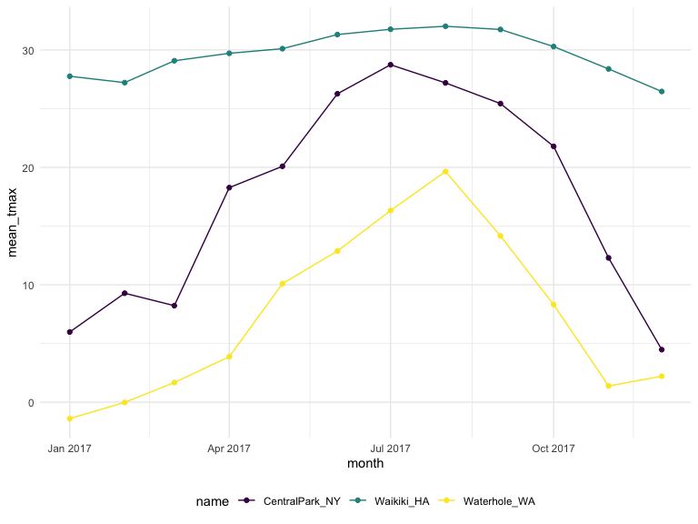
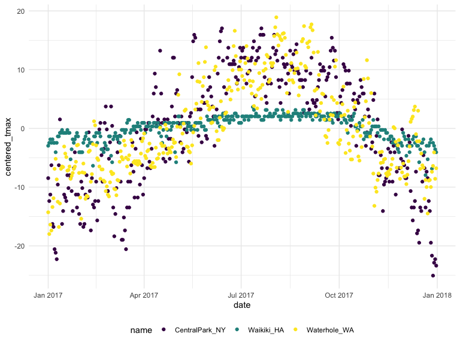

EDA
================
Weijia Xiong
10/1/2019

## data

``` r
weather_df = 
  rnoaa::meteo_pull_monitors(c("USW00094728", "USC00519397", "USS0023B17S"),  # download weather data
                      var = c("PRCP", "TMIN", "TMAX"), 
                      date_min = "2017-01-01",
                      date_max = "2017-12-31") %>%
  mutate(
    name = recode(id, USW00094728 = "CentralPark_NY", 
                      USC00519397 = "Waikiki_HA",
                      USS0023B17S = "Waterhole_WA"),
    tmin = tmin / 10,
    tmax = tmax / 10,
    month = lubridate::floor_date(date, unit = "month")) %>%   #floor_date() takes a date-time object and rounds it down to the nearest boundary of the specified time unit.
  select(name, id, everything())
```

    ## Registered S3 method overwritten by 'crul':
    ##   method                 from
    ##   as.character.form_file httr

    ## Registered S3 method overwritten by 'hoardr':
    ##   method           from
    ##   print.cache_info httr

    ## file path:          /Users/osukuma/Library/Caches/rnoaa/ghcnd/USW00094728.dly

    ## file last updated:  2019-09-03 10:46:14

    ## file min/max dates: 1869-01-01 / 2019-08-31

    ## file path:          /Users/osukuma/Library/Caches/rnoaa/ghcnd/USC00519397.dly

    ## file last updated:  2019-09-03 10:46:22

    ## file min/max dates: 1965-01-01 / 2019-08-31

    ## file path:          /Users/osukuma/Library/Caches/rnoaa/ghcnd/USS0023B17S.dly

    ## file last updated:  2019-09-03 10:46:25

    ## file min/max dates: 1999-09-01 / 2019-08-31

``` r
weather_df
```

    ## # A tibble: 1,095 x 7
    ##    name           id          date        prcp  tmax  tmin month     
    ##    <chr>          <chr>       <date>     <dbl> <dbl> <dbl> <date>    
    ##  1 CentralPark_NY USW00094728 2017-01-01     0   8.9   4.4 2017-01-01
    ##  2 CentralPark_NY USW00094728 2017-01-02    53   5     2.8 2017-01-01
    ##  3 CentralPark_NY USW00094728 2017-01-03   147   6.1   3.9 2017-01-01
    ##  4 CentralPark_NY USW00094728 2017-01-04     0  11.1   1.1 2017-01-01
    ##  5 CentralPark_NY USW00094728 2017-01-05     0   1.1  -2.7 2017-01-01
    ##  6 CentralPark_NY USW00094728 2017-01-06    13   0.6  -3.8 2017-01-01
    ##  7 CentralPark_NY USW00094728 2017-01-07    81  -3.2  -6.6 2017-01-01
    ##  8 CentralPark_NY USW00094728 2017-01-08     0  -3.8  -8.8 2017-01-01
    ##  9 CentralPark_NY USW00094728 2017-01-09     0  -4.9  -9.9 2017-01-01
    ## 10 CentralPark_NY USW00094728 2017-01-10     0   7.8  -6   2017-01-01
    ## # … with 1,085 more rows

## `group_by`

``` r
weather_df %>% 
  group_by(name,month)
```

    ## # A tibble: 1,095 x 7
    ## # Groups:   name, month [36]
    ##    name           id          date        prcp  tmax  tmin month     
    ##    <chr>          <chr>       <date>     <dbl> <dbl> <dbl> <date>    
    ##  1 CentralPark_NY USW00094728 2017-01-01     0   8.9   4.4 2017-01-01
    ##  2 CentralPark_NY USW00094728 2017-01-02    53   5     2.8 2017-01-01
    ##  3 CentralPark_NY USW00094728 2017-01-03   147   6.1   3.9 2017-01-01
    ##  4 CentralPark_NY USW00094728 2017-01-04     0  11.1   1.1 2017-01-01
    ##  5 CentralPark_NY USW00094728 2017-01-05     0   1.1  -2.7 2017-01-01
    ##  6 CentralPark_NY USW00094728 2017-01-06    13   0.6  -3.8 2017-01-01
    ##  7 CentralPark_NY USW00094728 2017-01-07    81  -3.2  -6.6 2017-01-01
    ##  8 CentralPark_NY USW00094728 2017-01-08     0  -3.8  -8.8 2017-01-01
    ##  9 CentralPark_NY USW00094728 2017-01-09     0  -4.9  -9.9 2017-01-01
    ## 10 CentralPark_NY USW00094728 2017-01-10     0   7.8  -6   2017-01-01
    ## # … with 1,085 more rows

``` r
weather_df %>%
  group_by(name) %>%
  summarize(n_obs = n())
```

    ## # A tibble: 3 x 2
    ##   name           n_obs
    ##   <chr>          <int>
    ## 1 CentralPark_NY   365
    ## 2 Waikiki_HA       365
    ## 3 Waterhole_WA     365

``` r
weather_df %>%
  group_by(month) %>%
  summarize(n_obs = n())
```

    ## # A tibble: 12 x 2
    ##    month      n_obs
    ##    <date>     <int>
    ##  1 2017-01-01    93
    ##  2 2017-02-01    84
    ##  3 2017-03-01    93
    ##  4 2017-04-01    90
    ##  5 2017-05-01    93
    ##  6 2017-06-01    90
    ##  7 2017-07-01    93
    ##  8 2017-08-01    93
    ##  9 2017-09-01    90
    ## 10 2017-10-01    93
    ## 11 2017-11-01    90
    ## 12 2017-12-01    93

``` r
weather_df %>%
  group_by(name,month) %>%
  summarize(n_obs = n())
```

    ## # A tibble: 36 x 3
    ## # Groups:   name [3]
    ##    name           month      n_obs
    ##    <chr>          <date>     <int>
    ##  1 CentralPark_NY 2017-01-01    31
    ##  2 CentralPark_NY 2017-02-01    28
    ##  3 CentralPark_NY 2017-03-01    31
    ##  4 CentralPark_NY 2017-04-01    30
    ##  5 CentralPark_NY 2017-05-01    31
    ##  6 CentralPark_NY 2017-06-01    30
    ##  7 CentralPark_NY 2017-07-01    31
    ##  8 CentralPark_NY 2017-08-01    31
    ##  9 CentralPark_NY 2017-09-01    30
    ## 10 CentralPark_NY 2017-10-01    31
    ## # … with 26 more rows

``` r
weather_df %>%
  group_by(month) %>%
  summarize(
    n_obs = n(),
    n_unique = n_distinct(date)) #distinct date
```

    ## # A tibble: 12 x 3
    ##    month      n_obs n_unique
    ##    <date>     <int>    <int>
    ##  1 2017-01-01    93       31
    ##  2 2017-02-01    84       28
    ##  3 2017-03-01    93       31
    ##  4 2017-04-01    90       30
    ##  5 2017-05-01    93       31
    ##  6 2017-06-01    90       30
    ##  7 2017-07-01    93       31
    ##  8 2017-08-01    93       31
    ##  9 2017-09-01    90       30
    ## 10 2017-10-01    93       31
    ## 11 2017-11-01    90       30
    ## 12 2017-12-01    93       31

``` r
weather_df %>%
  count(name)  #count unique name   count = group_by + summarize
```

    ## # A tibble: 3 x 2
    ##   name               n
    ##   <chr>          <int>
    ## 1 CentralPark_NY   365
    ## 2 Waikiki_HA       365
    ## 3 Waterhole_WA     365

``` r
weather_df %>%
  count(month,name = "n_days") 
```

    ## # A tibble: 12 x 2
    ##    month      n_days
    ##    <date>      <int>
    ##  1 2017-01-01     93
    ##  2 2017-02-01     84
    ##  3 2017-03-01     93
    ##  4 2017-04-01     90
    ##  5 2017-05-01     93
    ##  6 2017-06-01     90
    ##  7 2017-07-01     93
    ##  8 2017-08-01     93
    ##  9 2017-09-01     90
    ## 10 2017-10-01     93
    ## 11 2017-11-01     90
    ## 12 2017-12-01     93

``` r
weather_df %>%
  count(name,month) 
```

    ## # A tibble: 36 x 3
    ##    name           month          n
    ##    <chr>          <date>     <int>
    ##  1 CentralPark_NY 2017-01-01    31
    ##  2 CentralPark_NY 2017-02-01    28
    ##  3 CentralPark_NY 2017-03-01    31
    ##  4 CentralPark_NY 2017-04-01    30
    ##  5 CentralPark_NY 2017-05-01    31
    ##  6 CentralPark_NY 2017-06-01    30
    ##  7 CentralPark_NY 2017-07-01    31
    ##  8 CentralPark_NY 2017-08-01    31
    ##  9 CentralPark_NY 2017-09-01    30
    ## 10 CentralPark_NY 2017-10-01    31
    ## # … with 26 more rows

``` r
weather_df %>% 
  pull(name) %>% 
  table()  # hard to do addition work
```

    ## .
    ## CentralPark_NY     Waikiki_HA   Waterhole_WA 
    ##            365            365            365

``` r
weather_df %>% 
  count(name) %>%
  knitr::kable()
```

| name            |   n |
| :-------------- | --: |
| CentralPark\_NY | 365 |
| Waikiki\_HA     | 365 |
| Waterhole\_WA   | 365 |

## (2 x 2 table)

``` r
weather_df %>% 
  mutate(
    cold = case_when(
      tmax < 5 ~"cold",
      tmax >= 5~ "not cold",
      TRUE  ~""   #anything else
    )
  ) %>% 
  filter(name != "Waikiki_HA") %>% 
  group_by(name,cold) %>% 
  summarize(
    n_obs = n()
  ) %>% 
  pivot_wider(
    names_from = cold, 
    values_from = n_obs)
```

    ## # A tibble: 2 x 3
    ## # Groups:   name [2]
    ##   name            cold `not cold`
    ##   <chr>          <int>      <int>
    ## 1 CentralPark_NY    44        321
    ## 2 Waterhole_WA     172        193

``` r
weather_df %>% 
  mutate(cold = case_when(
    tmax < 5 ~ "cold",
    tmax >=5 ~ "not_cold",
    TRUE     ~ ""
  )) %>% 
  filter(name != "Waikiki_HA") %>% 
  janitor::tabyl(name, cold)
```

    ##            name cold not_cold
    ##  CentralPark_NY   44      321
    ##    Waterhole_WA  172      193

## gerneral summarize

``` r
weather_df %>% 
  group_by(name,month) %>% 
  summarize(
    n = n(),
    mean_tmax = mean(tmax,na.rm = TRUE),  #remove na
    sd_tmax = sd(tmax,na.rm = TRUE),
    median_prcp = median(prcp,na.rm = TRUE)
  ) %>% 
  ggplot(aes(x = month, y = mean_tmax, color = name)) + 
  geom_point() + geom_line() 
```



``` r
weather_df %>%
  group_by(name, month) %>%
  summarize(mean_tmax = mean(tmax)) %>% 
  pivot_wider(
    names_from = name,
    values_from = mean_tmax) %>% 
  knitr::kable(digits = 1)
```

| month      | CentralPark\_NY | Waikiki\_HA | Waterhole\_WA |
| :--------- | --------------: | ----------: | ------------: |
| 2017-01-01 |             6.0 |        27.8 |         \-1.4 |
| 2017-02-01 |             9.3 |        27.2 |           0.0 |
| 2017-03-01 |             8.2 |        29.1 |           1.7 |
| 2017-04-01 |            18.3 |        29.7 |           3.9 |
| 2017-05-01 |            20.1 |          NA |          10.1 |
| 2017-06-01 |            26.3 |        31.3 |          12.9 |
| 2017-07-01 |            28.7 |          NA |          16.3 |
| 2017-08-01 |            27.2 |        32.0 |          19.6 |
| 2017-09-01 |            25.4 |        31.7 |          14.2 |
| 2017-10-01 |            21.8 |        30.3 |           8.3 |
| 2017-11-01 |            12.3 |        28.4 |           1.4 |
| 2017-12-01 |             4.5 |        26.5 |           2.2 |

## don’t forget ungroup??

``` r
weather_df %>% 
  group_by(name) %>% 
  ungroup()
```

    ## # A tibble: 1,095 x 7
    ##    name           id          date        prcp  tmax  tmin month     
    ##    <chr>          <chr>       <date>     <dbl> <dbl> <dbl> <date>    
    ##  1 CentralPark_NY USW00094728 2017-01-01     0   8.9   4.4 2017-01-01
    ##  2 CentralPark_NY USW00094728 2017-01-02    53   5     2.8 2017-01-01
    ##  3 CentralPark_NY USW00094728 2017-01-03   147   6.1   3.9 2017-01-01
    ##  4 CentralPark_NY USW00094728 2017-01-04     0  11.1   1.1 2017-01-01
    ##  5 CentralPark_NY USW00094728 2017-01-05     0   1.1  -2.7 2017-01-01
    ##  6 CentralPark_NY USW00094728 2017-01-06    13   0.6  -3.8 2017-01-01
    ##  7 CentralPark_NY USW00094728 2017-01-07    81  -3.2  -6.6 2017-01-01
    ##  8 CentralPark_NY USW00094728 2017-01-08     0  -3.8  -8.8 2017-01-01
    ##  9 CentralPark_NY USW00094728 2017-01-09     0  -4.9  -9.9 2017-01-01
    ## 10 CentralPark_NY USW00094728 2017-01-10     0   7.8  -6   2017-01-01
    ## # … with 1,085 more rows

``` r
 #return to a non-grouped form
```

``` r
weather_df %>% 
  group_by(name) %>% 
  mutate(
    mean_tmax = mean(tmax,na.rm = TRUE),
    centered_tmax = tmax - mean_tmax
  ) %>% 
  ggplot(aes( x = date, y = centered_tmax,color = name))+
  geom_point()
```



window functions in grouped mutates

``` r
weather_df %>% 
  group_by(name,month) %>% 
  mutate(
    tmax_rank = min_rank(tmax)
  ) %>% 
  filter(tmax_rank == 1)
```

    ## # A tibble: 42 x 8
    ## # Groups:   name, month [36]
    ##    name         id        date        prcp  tmax  tmin month      tmax_rank
    ##    <chr>        <chr>     <date>     <dbl> <dbl> <dbl> <date>         <int>
    ##  1 CentralPark… USW00094… 2017-01-09     0  -4.9  -9.9 2017-01-01         1
    ##  2 CentralPark… USW00094… 2017-02-10     0   0    -7.1 2017-02-01         1
    ##  3 CentralPark… USW00094… 2017-03-15     0  -3.2  -6.6 2017-03-01         1
    ##  4 CentralPark… USW00094… 2017-04-01     0   8.9   2.8 2017-04-01         1
    ##  5 CentralPark… USW00094… 2017-05-13   409  11.7   7.2 2017-05-01         1
    ##  6 CentralPark… USW00094… 2017-06-06    15  14.4  11.1 2017-06-01         1
    ##  7 CentralPark… USW00094… 2017-07-25     0  21.7  16.7 2017-07-01         1
    ##  8 CentralPark… USW00094… 2017-08-29    74  20    16.1 2017-08-01         1
    ##  9 CentralPark… USW00094… 2017-09-30     0  18.9  12.2 2017-09-01         1
    ## 10 CentralPark… USW00094… 2017-10-31     0  13.9   7.2 2017-10-01         1
    ## # … with 32 more rows

lags and leads

``` r
weather_df %>% 
  group_by(name) %>% 
  mutate(
    lagged_tmax = lag(tmax),  # off by one 
    one_day_tmax_change = tmax - lagged_tmax
  ) %>% 
summarize(
 sd_daily_change = sd(one_day_tmax_change,na.rm = TRUE)
)
```

    ## # A tibble: 3 x 2
    ##   name           sd_daily_change
    ##   <chr>                    <dbl>
    ## 1 CentralPark_NY            4.45
    ## 2 Waikiki_HA                1.23
    ## 3 Waterhole_WA              3.13
